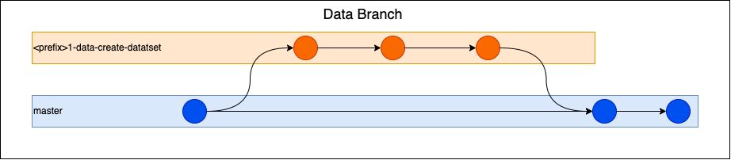
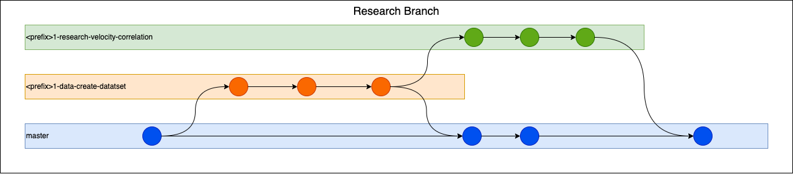
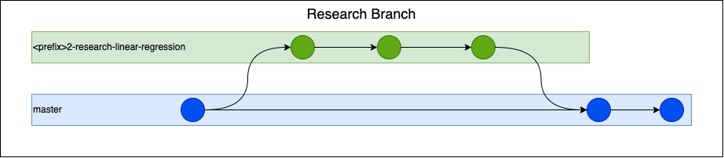
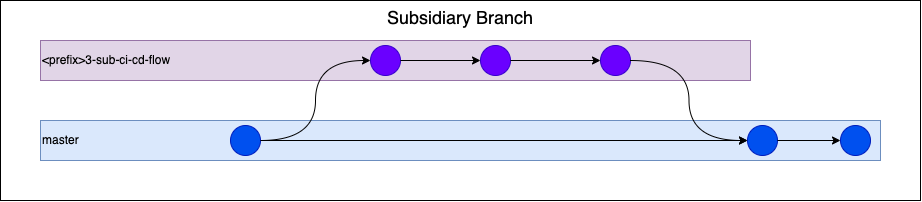

.. |---| unicode:: U+02014

.. raw:: html

    

.. role:: red

Contributing convention
=======================
Суть данного файла зафиксировать договоренности команды по ведению проекта.
Ниже будут описаны договоренности по ведению гита, написанию кода и отчетов.
Файл развивается итеративно и все члены команды могут вносить правки для улучшения применяемых практик и упрощения процесса работы.

Git workflow
------------
Одним из важных инструментов командной работы является **Git**.
Хорошей практикой является однообразная и понятная структура ведения git в проекте.
В мире есть best practices по ведению git, например, `gitflow <https://www.atlassian.com/ru/git/tutorials/comparing-workflows/gitflow-workflow>`_ или `github flow <https://docs.github.com/en/get-started/quickstart/github-flow>`_. Но эти практики создавались для ведения проектов классической разработки, в DS есть нюансы, поэтому мы изобретаем велосипед ¯\\_(ツ)_/¯

Собственно данная методология ведения гита основана на двух источниках `Development workflows for data science <https://resources.github.com/downloads/development-workflows-data-scientists.pdf>`_ и `DataScience Lifecycle Project <https://github.com/dslp/dslp>`_.

Основные поинты составления своей методологии:

1. Результаты исследования зачастую полезнее написанного кода.
2. Большое количество кода для проведения одного целостного исследования.
3. Не предсказуемая длительность проведения исследования.
4. Отсутствие релизов большую часть времени ведения проекта.

Предложенная методология позволяет сделать процесс исследования более прозрачным и предсказуемым по времени, а так же упрощает приемку результатов исследования. За основу методологии взят жизненный цикл исследования:

1. Выдвинуть гипотезу.
2. Собрать и подготовить данные для ее проверки.
3. Провести исследование для проверки гипотезы.
4. Написать отчет о проведенном исследовании и поделиться знаниями с командой.

На основе описанных этапов строится методология.
Проверяемая гипотеза описывается в issue карточке,
также там ведется уточняющая дискуссия при наличии каких либо вопросов выдвинутой гипотезе.

-------------------

Для сбора данных необходимых для проверки гипотезы создаются **data branches**, так же эти ветки используются при поготовке данных:

``<number>-data-<description>``

Где ``<number>`` |---| номер задачи из Jira, а ``<description>`` |---| краткое описание проверяемой гипотезы, например, ``anomaly-description``.

В такой ветке исследователь проводит работу над сбором данных, которые понадобятся для его исследования. Для этого он пишет код:

- очистки данных;
- предобработки данных;
- объедения и других трансформаций исходных данных.

Так же в этой ветке может находиться код для feature engeniring,
если он требует большого количества преобразований над данными (то есть больше пары строк).

Кроме кода исследователь обязан прописать отчет по данным содержащий следующее:

- от каких данных было начато исследование(например название датасета);
- пример исходных данных (буквально пара примеров из датасета);
- проведенные очистка, предобработка и трансформации данных;
- при составлении признаков — процесс как вычислялся признак;
- примеры итогового датасета;
- по возможности указать количественные характеристики(размеры) исходного и итогового датасета.

По завершению работ оформляется merge request данной ветки, где в описание включается подготовленный отчет.

Best practices:

- Описание схем данных с помощью pandera.
- Автоматическая генерация примеров данных с помощью snakemake.
- Генерируйте отчеты в html с помощью pandoc или sphinx.

------------

Для проведения исследования используются **research branches**:

``<number>-research-<description>``

Такие ветки могут быть как логическим продолжением **data branches**, так и возникать самостоятельно, если не требуется подготовка данных.

В таких ветках исследователь пишет код по самому исследованию:

- статистические тесты;
- отбор признаков;
- feature enginering;
- train/test split;
- cross-validation;
- подсчитываемые метрики;
- обучение модели;
- оценка качества модели;
- сохранение моделей;
- настройка гиперпараметров;
- утилиты для составления отчетов (таблицы, графики и тд).

Так же исследователь дополняет отчет из **data branch** или же создает новый (упоминая там гипотезу и используемые данные). В отчет включается следующая информация:

- описание проводимого эксперимента;
- полученные результаты(метрики, картинки, таблицы и тд);
- выводы полученные исследователем;
- следующие шаги, которые стоит предпринять.

По завершению работы над исследованием создается merge request с описанием из отчета.

Best practices:

- Фиксируйте random state;
- Не меняйте подготовку данных, лучше начните новое исследование;
- Генерируйте отчеты в html с помощью pandoc или sphinx.

:red:`Имейте цель в виду, когда вы начинаете исследовать. Очень легко упасть в кроличью нору. Если вы не можете поставить перед собой цель, определите время своего исследования и подведите итог тому, что вы найдете в конце.`

------------

Если появляется необходимость исправить опечатки, readme.md, contributing.md, внести изменения в CI, настройки для линтеров или же исправить какие-то баги.
То для этого создается **subsidiary branches**:

``<number>-sub-<description>``

В таких ветках проводятся вспомогательные работы, не имеющие отношения к исследованию.

------------

Commit convention
-----------------

Кроме единообразной и понятной работы с ветвями необходимо договориться и о шаблоне коммитов. Для этого есть большое количество инструментов, в нашем проекте используется два основных:

- `VScode Git Commit Message <https://marketplace.visualstudio.com/items?itemName=rioukkevin.vscode-git-commit>`_ |---| расширения для создания коммитов по шаблону в vscode.
- `Commitizen <https://commitizen-tools.github.io/commitizen/>`_ |---| cli инструмент для коммитов по паттерну. Что бы закоммитить изменения используйте ``cz commit``.

В обоих инструментах установлен единый паттерн сообщения коммита: ``"{prefix}[{issue}]: {message}"``.

Сначала надо выбрать префикс сообщения коммита:

- wip |---| в процессе работы;
- fix |---| исправление каких-то ошибок и багов;
- docs |---| изменение документации;
- sub |---| какая-то вспомогательная работа;
- ref |---| рефакторинг кода.

Далее необходимо указать номер issue, в рамках которого ведется задача. Например, если работы  проходят по задаче ``90``, надо указать ``90`` и он номер будет подставлен в паттерн.

После этого можно ввести сообщение, которое описывает ваше изменение. Тут также есть  некоторые рекомендации по написанию сообщения:

1. Будьте **краткими** (всего не более 150 символов).
2. Используйте `imperative mood <https://initialcommit.com/blog/Git-Commit-Message-Imperative-Mood>`_
3. Старайтесь делать коммиты атомарными, что бы в сообщении не использовались **союз "и"** или **знаки препинания**.
4. Используйте английский язык.
5. Ставьте точки в конце сообщения.

Пример хорошего коммита: ``docs[90]: update contributing convention for commits.``

Также для удобства работы настроен **pre-commit hook**, что установить его у себя надо выполнить:
    ``pre-commit install --hook-type commit-msg``

Report convention
-----------------

Так же к совместной работе относится накопление знаний по проекту.
Для этого надо договориться о структуре отчетов по исследованиям.
На текущей момент предлагается такая структура:

::

   1) Введение - секция, в которой надо ответить на следующее вопросы:
      - Какую гипотезу вы проверяете?
      - Для чего в целом вы проводите данное исследование?
      - Какой результат вы ожидаете?
   2) Данные для исследования:
      - Какой датасет вы использовали в исследовании?
      - Пример данных, которые вы взяли для исследования?
      - Какие манипуляции вы делали над данными?
      - Пример данных, которые вы получили?
      - Как количественно и качественно изменился датасет?
   3) Постановка эксперимента:
      - Какие инструменты вы используете?
      - Почему именно они?
      - Есть ли какая-то специфика эксперимента? Расскажите о ней.
   4) Полученные результаты:
      - Что вы получили в результате эксперимента?
      - Покажите таблицы, графики, метрики моделей и прочее.
   5) Выводы:
      - Как вы интерпретируете свои результаты?
      - Что важного можно из них вынести?
      - Какие следующие шаги вы видите?

Отчет по данным входит в состав отчета по исследованию,
но при обработке данных на начальных этапах является отдельным документом.
Он содержит следующую информацию:

::

    - Какой датасет вы использовался для предобработки?
    - Пример изначальных данных, которые вы взяли?
    - Какие манипуляции вы делали над данными?
    - Пример данных, которые вы получили?
    - Как количественно и качественно изменился датасет?

Отчет оформляется в виде rst файла, все вставки (картинки, таблицы, html и тд) импортируются как файлы.
Для генерации можно использоватьследующие инструменты: sphinx и pandoc.

pandoc
------

Для удобства установки можно использовать conda:

.. code-block:: shell

    conda create -n docs pandoc
    conda activate docs

На текущий момент наилучший результат показывает конвертация rst в html.
Полученный html файл рекомендуется в ставлять в описание merge request.

.. code-block:: shell

    pandoc ./path/to/file.rst -o report.html -t html -f rst --resource-path=path/to/resources

Важные флаги:

- `-t` - указывает в какой формат проводить конвертацию;
- `-f` - указывает из какого формата конвертировать;
- `-o` - указывает файл выходного результата;
- `--resource-path` - указывает папку с ресурсами (картинками, таблицами и тд) относительно которой записаны пути в rst файле;
- `--self-contained` - позволяет записать изображения внутрь отчёта.html в виде base64 строк;
- `--standalone` - позволяет собрать цельный html файл с header и footer частями.

Всю документацию можно найти `тут <https://pandoc.org/MANUAL.html>`_.
